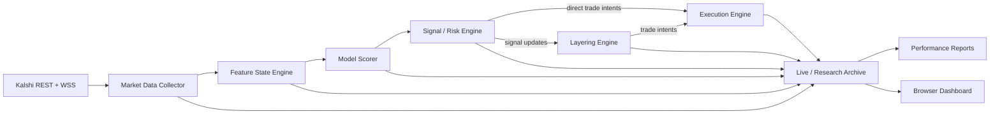
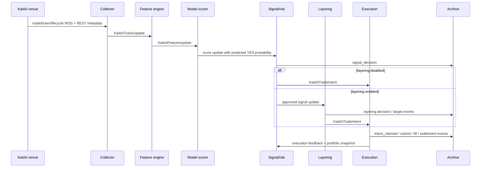

# Kalshi Trading Agent Architecture

Last updated: 2026-04-17

This is a living document for the trading stack implemented under `src/live/kalshi/` and the runner scripts in `scripts/`. It is intended to explain how the agent works from market-data ingestion through model scoring, risk checks, thesis construction, execution, archival, reporting, and testing.

## 1. Purpose and Operating Modes

The agent is an event-driven Kalshi trading and research system focused on short-dated binary markets, especially the `KXBTC15M` series. Its primary capabilities are:

- ingest real-time Kalshi market data over WebSocket and periodic REST refreshes
- engineer live microstructure features from trades, quotes, and market metadata
- score markets with trained machine-learning models
- convert model outputs into trade intents subject to configurable risk controls
- optionally build multi-tranche path-dependent theses through a layering engine
- execute in `paper`, `shadow`, or `live` mode
- persist an auditable event log for analysis, dashboards, and repair/backfill workflows
- support offline model training, calibration, policy selection, and walk-forward evaluation

The system currently operates in four closely related modes:

| Mode | Primary runner(s) | Purpose |
| --- | --- | --- |
| Dedicated live/shadow | `scripts/run_kalshi_bagged_lasso_live.py` | Production-oriented single-model bot with live-specific policy controls and optional layering |
| Shared paper/live multi-model | `scripts/run_kalshi_multi_model_execution_engine.py` | Run multiple trained models on one shared market-data stream |
| Research preview | `scripts/run_kalshi_research_multi_model.py` | Record opportunities and later settle them without using the execution engine |
| Offline training/evaluation | `scripts/train_kxbtc15m_*.py`, `src/live/kalshi/offline_training.py` | Build datasets, train models, calibrate probabilities, and choose deployable policies |

## 2. System Design

The trading stack is designed as an event-driven, modular Python system with clear separation between market-data ingestion, model inference, policy/risk decisions, thesis construction, and execution. The design goal is to keep research logic auditable, execution behavior realistic, and production controls configurable without forcing each runner to reimplement the stack.

### Design principles

- separate the signal clock from the execution clock so models do not mechanically chase every quote flicker
- keep modules loosely coupled through typed configs, typed updates, async tasks, and append-only JSONL archives
- preserve research-to-production continuity by sharing most core engines across `paper`, `shadow`, and `live`
- prefer explainable controls over opaque heuristics by logging block reasons, retry reasons, sizing decisions, and settlement outcomes
- make failures recoverable through idempotent archives, periodic reconciliation, and restart-safe ledger state
- treat execution realism as a first-class concern even in non-live modes by simulating current executable market prices instead of stale intent prices

### Design consequences in this codebase

- a collector owns the venue connection and pushes normalized market updates downstream
- feature engines maintain rolling state and publish scored snapshots rather than exposing raw mutable state everywhere
- the signal/risk engine decides whether a candidate is valid, but execution only acts on explicit trade intents
- the layering engine can sit between signal approval and execution to enforce path-dependent thesis logic
- archival is part of the runtime design, not an afterthought; every major engine writes structured events for later repair, dashboards, and performance analysis

## 3. Top-Level Architecture

The online system is built around a shared set of async engines connected by queues and callback subscriptions. Each engine emits typed updates and also writes JSONL events for auditability.

## 4. Core Modules

### 4.1 Startup and Configuration

Primary files:

- `scripts/run_kalshi_bagged_lasso_live.py`
- `scripts/run_kalshi_multi_model_execution_engine.py`
- `scripts/run_kalshi_research_multi_model.py`
- `scripts/run_kalshi_regularized_execution_engine.py`
- `src/live/kalshi/config.py`

Responsibilities:

- load environment variables from `.env`
- resolve model artifact paths and optional `policy.json`
- build module configs
- wire collectors, feature engines, scorers, signal engines, layering engines, execution engines, and archive managers
- select mode-specific behavior such as `paper`, `shadow`, or `live`

Important configuration surfaces:

| Module | Config type | Examples of important knobs |
| --- | --- | --- |
| Collector | `KalshiCollectorConfig` | environment, subscribed series/tickers, metadata refresh interval, reconnect backoff |
| Feature engine | `KalshiFeatureEngineConfig` | rolling windows, publish-series filter, hourly context selection |
| Signal/risk | `KalshiSignalRiskConfig` | edge thresholds, tau window, price band, regime gate, stacking, reserve cash, bucket bans, side-exposure cap |
| Layering | `KalshiPathDependentBinaryLayeringConfig` | tranche schedule, retry cooldown, quote-change dedupe, initial-fill gating, recovery |
| Execution | `KalshiExecutionConfig` | mode, live trading enablement, pre-submit checks, order TIF, subaccount, reconcile interval, YES/NO IOC cushions |
| Research sampler | `KalshiResearchSamplerConfig` | min edge, tau window, price band, quote age, sample size, bucket bans |

### 4.2 Venue Authentication and Transport

Primary files:

- `src/live/kalshi/auth.py`
- `src/live/kalshi/client.py`
- `src/live/kalshi/config.py`

Responsibilities:

- resolve Kalshi credentials from environment variables
- sign REST and WebSocket requests with RSA-PSS over `timestamp + method + path`
- provide authenticated REST access to markets, order books, orders, balances, positions, and cancellations

Transport details:

- REST: HTTPS JSON via `httpx`
- Public and private streams: WSS JSON via `websockets`
- Signing: `KALSHI-ACCESS-KEY`, `KALSHI-ACCESS-SIGNATURE`, `KALSHI-ACCESS-TIMESTAMP`

Security notes:

- credentials are loaded from environment variables and PEM files
- the system filters private-order and position updates by configured subaccount
- the code does not currently integrate with a secret manager; `.env` and PEM handling remain an operational responsibility

### 4.3 Market Data Collector

Primary file:

- `src/live/kalshi/collector.py`

Responsibilities:

- open the Kalshi public WebSocket stream
- subscribe to `trade`, `ticker`, and `market_lifecycle_v2`
- maintain the latest per-market state in memory
- periodically refresh market metadata over REST
- merge partially populated YES/NO quotes and sizes into a coherent binary-book state
- emit both normalized ticker updates and raw stream events

Key techniques:

- WebSocket reconnect loop with exponential backoff
- stale-event filtering based on exchange timestamps
- REST fallback for full market snapshots
- demo-mode public-market fallback to production data when a final result is missing

Validation performed:

- reject stale trade/ticker messages
- normalize quotes from either direct YES/NO quotes or inferred complementary quotes
- only publish state changes

Key log events:

- `collector_started`
- `ws_connecting`, `ws_connected`, `ws_disconnected`, `ws_reconnect_scheduled`
- `metadata_refresh_started`, `metadata_refresh_completed`
- `rest_market_snapshot`, `rest_market_snapshot_failed`

### 4.4 Feature State Engine

Primary files:

- `src/live/kalshi/feature_engine.py`
- `src/live/kalshi/features.py`

Responsibilities:

- transform `KalshiTickerUpdate` objects into scoreable `KalshiFeatureState` objects
- maintain rolling windows for trade count, signed flow, price return, and volatility
- enrich `KXBTC15M` markets with optional hourly BTC context from `KXBTCD`

Feature families:

- price/quote context: `z_implied`, `price_momentum`, `distance_from_mid`, `quote_mid_prob`, `quote_spread_cents`
- recency: `tau_minutes`, `time_since_last_trade_seconds`, `minutes_since_market_open`
- rolling microstructure: `trade_count_{30,120,300}s`, `contracts_sum_*`, `signed_contracts_sum_*`, `yes_taker_share_*`
- derived volatility and return features
- hourly-context features such as `kxbtcd_atm_*`, `k15_minus_k1h_*`, and `k15_k1h_atm_direction_agreement`

Preprocessing techniques:

- clip raw probabilities into `[0.01, 0.99]`
- convert implied probabilities to z-scores with bounded infinities
- fill missing hourly context with deterministic zero-like payloads
- only publish scoreable states for configured series

### 4.5 Model Scorers and Calibration

Primary files:

- `src/live/kalshi/scorer.py`
- `src/live/kalshi/calibration.py`
- `scripts/train_kxbtc15m_lasso.py`
- `scripts/train_kxbtc15m_elastic_net.py`
- `scripts/train_kxbtc15m_bagged_lasso.py`
- `scripts/train_kxbtc15m_linear_svm.py`
- `scripts/train_kxbtc15m_lightgbm.py`

Supported model families:

- LASSO logistic regression
- Elastic Net logistic regression
- Bagged LASSO
- Linear SVM
- LightGBM

How scoring works:

1. the scorer subscribes to feature updates
2. the feature row is projected into the artifact’s expected feature order
3. the model returns a predicted YES probability
4. optional Platt scaling recalibrates the raw probability
5. the scorer emits a `KalshiLightGBMScoreUpdate`-shaped object regardless of underlying model family

Training data:

- sourced from extracted Kalshi market/trade parquet datasets
- organized around `KXBTC15M` as the target series
- optionally joined to hourly BTC context series `KXBTCD`
- split through a `split_manifest.json` into train, validation, and test tickers

Training and evaluation techniques:

- standardization for linear models
- L1 and elastic-net regularization for logistic regression
- bagging over logistic estimators for bagged lasso
- linear margin model for SVM plus post-hoc calibration
- LightGBM training with optional Optuna hyperparameter search and early stopping
- Platt calibration fit on validation outputs, then persisted to `calibration.json`
- walk-forward evaluation across chronological market blocks

Persisted metrics:

- `metrics.json`
- raw and calibrated predictions
- `policy.json`
- diagnostics including calibration buckets and policy metrics

Representative offline metrics include:

- log loss
- best iteration for LightGBM
- calibration error by probability bucket
- policy results such as trades, net PnL, drawdown, and return percent

### 4.6 Signal and Risk Engine

Primary file:

- `src/live/kalshi/signal_risk.py`

Responsibilities:

- convert model scores into tradeable YES/NO decisions
- enforce quote sanity, edge thresholds, tau window, and capital constraints
- compute side-specific entry prices, expected edge, fees, cash required, and optional Kelly sizing
- emit `signal_decision` updates and optionally reserve a `KalshiTradeIntent`

Decision logic highlights:

- side-aware quote gating: a bad YES quote no longer automatically blocks a valid NO quote
- edge is evaluated after slippage and fees
- configurable price-band filtering
- optional low-liquidity/chop block using rolling trade count, volume, signed flow, and volatility
- structural regime gating using hourly context with hysteresis
- bucket-ban and combo-ban policies
- ticker lock / stacking signatures
- reserve cash and ticker-side exposure caps

Important distinction:

- `approved` means the signal/risk layer found a tradeable opportunity
- `claimed` happens later, when the execution layer actually takes ownership of an emitted trade intent

When `auto_reserve_trade_intents` is true, an approved decision may immediately create a `KalshiTradeIntent`. When layering is enabled, runners disable auto-reservation and the layering engine decides when an approved signal becomes an executable intent.

### 4.7 Path-Dependent Layering Engine

Primary file:

- `src/live/kalshi/layering.py`

Responsibilities:

- manage path-dependent theses for `KXBTC15M`
- break a thesis into `10m`, `5m`, `4m`, and `3m` windows
- track `KalshiBinaryThesisLedger` and `KalshiBinaryTranche` objects
- implement persistent target-fill behavior in live mode
- enforce the hybrid initial-fill rule:
  - `10m` opens the thesis
  - if no contract has filled yet, `5m` may place only a small recovery probe
  - `4m` and `3m` are blocked until at least one earlier contract fills

Live-target behavior:

- create stable `target_id` objects above individual order attempts
- retry with bounded repricing inside a hard max price
- refresh reservation caps on the signal clock, not on every micro-tick
- pause when price exceeds cap and resume when price returns
- allow opposite-side retargeting when a fresh approved signal flips
- work one active live order per thesis at a time

Risk constraints inside layering:

- total thesis budget
- worst-case-loss limit
- expected-value check for additional layers
- cumulative ledger recomputation after each emission or execution update

### 4.8 Execution Engine

Primary file:

- `src/live/kalshi/execution.py`

Responsibilities:

- claim trade intents from either the signal engine or the layering engine
- simulate or submit orders depending on mode
- monitor orders over private WebSocket plus periodic reconciliation
- update signal-engine portfolio state and realized PnL
- settle finished markets

Execution modes:

| Mode | Behavior |
| --- | --- |
| `paper` | non-live simulated fills, but now quote-aware and limited by current executable market price |
| `shadow` | simulated fills with configurable latency and live-like repricing checks |
| `live` | real order submission to Kalshi with private-order monitoring |

Order selection and handling:

- live mode supports `immediate_or_cancel`, `fill_or_kill`, and `good_till_canceled`
- pre-submit orderbook/feed checks can block when price moves away or size is insufficient
- YES/NO immediate-order cushions can widen the executable limit for IOC probes
- if a non-live market price moves beyond the original limit, the engine now re-evaluates using refreshed maintain-edge logic before cancelling

Monitoring and recovery:

- private WebSocket subscriptions: `user_orders`, `fill`, `market_positions`
- reconcile loop refreshes balances, positions, orders, and settlements
- duplicate order IDs and transient HTTP failures trigger reconcile-or-retry logic
- cancellations and submission errors are logged with compact reasons

Current risk-management reality:

- the engine enforces pre-entry constraints and per-ticker/per-side caps
- it does not implement stop-loss exits
- it does not implement a portfolio-level max-drawdown kill switch
- by default, the path-dependent strategy is hold-to-settlement

### 4.9 Research Sampler and Research Ledger

Primary file:

- `src/live/kalshi/research/engine.py`

Responsibilities:

- record model opportunities without going through the execution engine
- settle them later against observed final market outcomes
- support research-bucket discovery and post-trade diagnostics

This path is useful for broad signal discovery when the team wants to study negative buckets or policy effects without committing to execution semantics.

### 4.10 Archival, Reporting, and Dashboarding

Primary files:

- `src/live/kalshi/live_archive.py`
- `src/live/kalshi/research_archive.py`
- `src/live/kalshi/performance_analysis.py`
- `scripts/analyze_kalshi_performance.py`
- `scripts/backfill_kalshi_live_execution_settlements.py`
- `tools/live_trading_dashboard.html`
- `tools/live_trading_dashboard.js`

Responsibilities:

- archive market, feature, model, signal, execution, and layering events
- stage event streams into `market_events`, `feature_rows`, `model_outputs`, and `strategy_events`
- compact archival JSONL streams with Zstandard
- generate offline and live performance reports
- drive the local browser dashboard from `output/live/...` or copied EC2 logs
- backfill settlements for historical paper/shadow runs when needed

Key report outputs include:

- `report.md`
- model totals
- execution-quality summaries
- target-execution summaries
- canonical row exports

### 4.11 Offline Training and Artifact Publication

Primary file:

- `src/live/kalshi/offline_training.py`

Responsibilities:

- resolve raw market/trade inputs
- build cached feature datasets
- create split manifests
- search hyperparameters
- train models
- calibrate validation predictions
- sweep signal/risk policy grids
- publish a `latest/` deployable artifact set

Artifact layout generally includes:

- model file (`model.joblib` or `model.txt`)
- `metrics.json`
- `calibration.json`
- `policy.json`
- split manifest
- diagnostics and predictions

## 5. End-to-End Runtime Flow

## 6. Signal Acquisition, Preprocessing, and Feature Engineering

### Data sources

- Kalshi public WebSocket:
  - trade events
  - ticker/book updates
  - market lifecycle updates
- Kalshi REST:
  - market metadata
  - market snapshots
  - live order books
  - balances, positions, orders
- Local historical parquet data:
  - used for offline training and walk-forward evaluation

### Preprocessing pipeline

1. normalize exchange payloads into `KalshiTickerState`
2. merge partial YES/NO quote fields into a complete binary-book view
3. derive market probability, trade probability, quote midpoint, spread, and quote age
4. compute rolling statistics over 30s, 120s, and 300s
5. enrich `KXBTC15M` states with `KXBTCD` hourly-context features when configured
6. publish only scoreable feature states

### Signal interpretation

The scorer predicts YES-settlement probability. The signal layer then interprets that prediction into a tradable side by comparing:

- predicted YES probability
- implied market probability from current book/trade state
- side-specific executable price
- fees and configured slippage

The side with the best post-cost edge that also satisfies quote, price-band, regime, and capital rules becomes the candidate.

## 7. Decision-Making, Risk, and Position Sizing

This section describes the agent's risk management strategy: how an approved model signal is filtered, sized, capped, and sometimes rejected before it can become an executable trade intent.

### Risk management strategy summary

- enforce venue and quote sanity before taking model output seriously
- require configurable post-cost edge thresholds for new entries, with separate maintain-edge logic for continued working orders
- cap same-market same-side exposure, reserve cash, and thesis-level loss
- optionally block by regime, bucket policy, combo policy, tau window, and low-liquidity chop
- size positions conservatively and reduce or block layering when no initial fill has been established

### Position sizing

Supported sizing techniques in the current architecture:

- fixed `contracts_per_order`
- capital-percent sizing
- Kelly-based sizing with multiplier and cap
- thesis-level budget allocation in the layering engine

### Risk controls currently implemented

- tau window filters
- post-cost edge thresholds
- maintain-edge threshold for already-open retries
- price-band limits
- quote staleness and consistency checks
- regime hard gates and blocked-regime labels
- low-liquidity/chop gate
- per-ticker side exposure cap
- reserve cash percent
- stacking signatures and ticker locks
- thesis budget / EV / worst-case-loss constraints

### Risk controls not currently implemented

These are important architectural gaps to understand:

- no stop-loss order logic
- no portfolio-wide drawdown stop
- no centralized diversification optimizer beyond reserve cash and per-market exposure caps
- no explicit external alerting service or incident pager

## 8. Order Execution and Monitoring

This section describes the execution logic: how the system turns an approved trade intent into a simulated or live order attempt, prices that attempt, monitors it, and reconciles the result back into position state and PnL.

### Execution logic overview

- execution claims explicit trade intents instead of acting directly on raw approved signals
- limit pricing is adjusted per mode, side, time-in-force, and configured cushion rules
- non-live fills are quote-aware and attempt to mirror executable market-taker pricing at decision time
- live execution routes through Kalshi REST/private-WSS flows and reconciles outcomes with periodic polling
- target-aware layering can resubmit, pause, resume, or expire working intents according to thesis state

### Live execution

Live execution connects directly to Kalshi and:

- optionally checks the feed/orderbook before submit
- submits an order with a chosen TIF
- listens to private order and fill streams
- reconciles against REST state when needed
- updates the in-memory and logged execution state until filled, cancelled, rejected, errored, or settled

### Non-live execution

Paper and shadow modes are designed to be execution-realistic:

- the engine rechecks the current executable market price before fill
- if the market moved beyond the original limit, it can refresh against maintain-edge logic
- if the price still fits the refreshed reservation, the simulated fill occurs at the current executable market price
- otherwise the simulated order cancels

This is the correct behavior for evaluating whether a paper or shadow run is still market-taker realistic.

## 9. Inter-Module Interfaces and System Interconnections

### Internal interfaces

The stack uses strongly typed dataclass messages plus asyncio queues/callbacks:

- `KalshiTickerUpdate`
- `KalshiFeatureUpdate`
- score updates from the scorer
- `KalshiSignalDecisionUpdate`
- `KalshiTradeIntent`
- `KalshiExecutionUpdate`
- `KalshiLayeringDecision`

Modules communicate primarily through:

- `subscribe_queue(...)`
- `subscribe(...)`
- `subscribe_trade_intent_queue(...)`
- `subscribe_trade_intent_callback(...)`

### External interfaces

| Integration | Protocol | Data format | Purpose |
| --- | --- | --- | --- |
| Kalshi public market feed | WSS | JSON | trades, tickers, lifecycle |
| Kalshi private account feed | WSS | JSON | user orders, fills, market positions |
| Kalshi trading API | HTTPS | JSON | order entry, cancel, balance, positions, orderbook |
| Local event store | filesystem | JSONL / `.jsonl.zst` | audit logs and staged archives |
| Dashboard | browser file-system access | JSONL parsing in JS | live run monitoring without a backend |

### Security considerations

- authenticated venue calls use RSA-PSS signed headers
- environment-specific credentials are isolated by env var prefixes
- subaccount numbers are validated during live preflight
- logs should not be treated as secret-safe by default; operators must avoid placing credentials in CLI flags or ad hoc payloads

## 10. Error Handling, Logging, Validation, and Recovery

The architecture is intentionally verbose in its event logging. The most important design goal is that logs explain why a decision was made or blocked, not just what the system did.

### Module-level strategy

| Module | Validation examples | Recovery / error handling | Typical explanation fields |
| --- | --- | --- | --- |
| Collector | stale message filtering, quote merge checks, market open/final state checks | reconnect with backoff, metadata refresh, public-market fallback in demo | event source, ticker, `error`, `attempt` |
| Feature engine | scoreable-state gating, hourly context staleness/trade-count checks | rebuild state from collector snapshot | source, ticker, event time |
| Signal/risk | quote usability, price band, edge threshold, regime, exposure, cash | block with explicit reason instead of silent skip | `block_reason`, buckets, regime votes, edge fields |
| Layering | supported window, initial-fill rule, thesis budget, EV, hard-price rules | keep ledgers, recovery lookback, target pause/resume | `action`, `message`, `target_id`, `attempt_index` |
| Execution | feed/orderbook checks, TIF handling, quote-aware simulated fill checks | cancel, reconcile, retry, private-WS recovery, REST reconciliation | `message`, `retry_reason`, `status_code`, `reason` |
| Reporting | tolerant JSONL parsing, dedupe, timestamp parsing | skip bad rows, backfill settlements, row-export toggles | notes, warnings, skipped lines |

### Current logging and observability surface

- engine-specific JSONL event logs under `output/live/...`
- archive output under `archive/` staging and compacted files
- console consumers in runners for signal/execution/layering summaries
- local dashboard for browser-based inspection
- performance reports for post-run analysis

### Alerting

Current state:

- no built-in external alert channel such as email, Slack, PagerDuty, or CloudWatch alarms
- operational monitoring currently relies on console output, tmux sessions, JSONL logs, dashboard views, and report generation

Recommended enhancement:

- add structured alert adapters around fatal runner exit, repeated WebSocket disconnects, reconcile failures, and policy-budget exhaustion

## 11. Testing Requirements and Existing Coverage

The repository already contains broad test coverage in `tests/`, including:

- `test_kalshi_live_collector.py`
- `test_kalshi_feature_engine.py`
- `test_kalshi_lightgbm_scorer.py`
- `test_kalshi_regularized_scorer.py`
- `test_kalshi_signal_risk.py`
- `test_kalshi_layering.py`
- `test_kalshi_execution.py`
- `test_kalshi_live_archive.py`
- `test_kalshi_research.py`
- `test_kalshi_offline_training.py`
- `test_kalshi_performance_analysis.py`
- backfill and runner-specific tests

### Required test layers

#### Unit tests

Examples:

- quote merge and implied complementary quote behavior
- feature window calculations
- scorer artifact loading and calibration
- edge calculation and max acceptable entry price logic
- regime and low-liquidity/chop gating
- sizing and ticker-side exposure cap math

Expected outcomes:

- deterministic outputs for fixed inputs
- explicit block reasons for every rejection path
- no silent success on malformed data

#### Integration tests

Examples:

- collector -> feature engine -> scorer -> signal engine
- signal engine -> layering engine -> execution engine
- private WebSocket order/fill handling
- archive manager writing one coherent run directory
- dashboard parser and settlement backfill scripts

Expected outcomes:

- claimed decisions line up with emitted trade intents
- settled states release exposure and update realized PnL
- persistent targets do not double count attempts or open positions

#### Offline strategy validation

Examples:

- train/validation/test splits from `split_manifest.json`
- walk-forward evaluation across chronological blocks
- calibration diagnostics
- policy grid sweeps for edge/tau/price-band settings

Expected outcomes:

- model and policy artifacts are reproducible
- metrics files include the fields required by runtime scorers and dashboards
- deployable artifacts are published into `artifacts/kalshi/.../latest/`

#### Backtesting / simulation fidelity checks

Examples:

- paper/shadow fills reprice to current executable market price
- fills cancel when the moved price no longer fits the refreshed edge
- settlement repair scripts reconcile lingering paper/shadow positions

Expected outcomes:

- simulated runs remain close to real market-taker behavior
- historical shadow/paper runs can be repaired into consistent settled state

## 12. Coding Standards

The implementation language is Python 3.9+.

Required conventions:

- type hints on public functions, dataclasses, and interfaces
- docstrings on new public modules, classes, and non-trivial functions
- async patterns for long-lived engines and external I/O
- dataclass-based state passing where practical
- PEP 8 compatible formatting
- `ruff` for linting and import hygiene
- `pytest` for tests

## 13. Known Gaps and Future Enhancements

Priority future work:

1. Add portfolio-level safety stops.
   The current system has strong pre-entry controls but no session kill switch.

2. Add first-class external alerting.
   Logs are rich, but the architecture still relies too much on manual observation.

3. Improve portfolio construction.
   Exposure controls are mostly per-ticker and per-side. Cross-model and cross-thesis optimization is still primitive.

4. Expand research/live parity documentation.
   The architecture now has several closely related execution modes; keeping them explicitly documented is important.

5. Continue improving dashboard and backfill consistency.
   The browser dashboard is valuable, but it depends heavily on correct event stitching and settlement repair.

6. Formalize OMS-like abstractions.
   The live execution layer currently talks directly to Kalshi. A separate internal OMS boundary would simplify future venue expansion.

7. Continue validating simulation realism.
   Paper and shadow runs are now quote-aware, but they should keep being benchmarked against real taker prices.

## 14. Recommended Reading Order in the Codebase

For engineers onboarding to this system, the fastest path is:

1. `scripts/run_kalshi_bagged_lasso_live.py`
2. `src/live/kalshi/collector.py`
3. `src/live/kalshi/feature_engine.py`
4. `src/live/kalshi/scorer.py`
5. `src/live/kalshi/signal_risk.py`
6. `src/live/kalshi/layering.py`
7. `src/live/kalshi/execution.py`
8. `src/live/kalshi/live_archive.py`
9. `src/live/kalshi/performance_analysis.py`
10. `src/live/kalshi/offline_training.py`

That sequence mirrors the actual control flow of the live system and the lifecycle of a deployable model.
