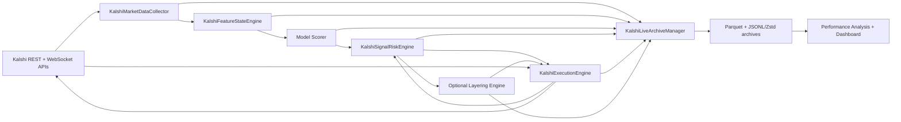

# Live Trading System Report

## Scope

This report documents the live Kalshi trading stack in `src/live/kalshi` and the runner scripts in `scripts/`. The focus is the production-oriented path used by the dedicated bagged-lasso bot, with supporting notes on the older single-model and multi-model runners.

## Executive Summary

- The codebase is primarily Python and targets Python `>=3.9` in `pyproject.toml`; the checked local environment is Python `3.12.9`.
- The live trading stack does not use a web framework such as Django or Flask. It is an `asyncio` event-driven pipeline built on top of `websockets` and `httpx`.
- The current production-oriented entry point is `scripts/run_kalshi_bagged_lasso_live.py`, which wires together:
  `KalshiMarketDataCollector -> KalshiFeatureStateEngine -> KalshiRegularizedLogisticScorer -> KalshiSignalRiskEngine -> KalshiExecutionEngine`, with optional `KalshiPathDependentBinaryLayeringEngine` and `KalshiLiveArchiveManager`.
- The live stack is well covered by focused tests. A targeted run of the live-stack suite passed: `105 passed in 105.03s`.
- The main architectural strengths are explicit state models, queue-based decoupling, strong replay/archive support, and meaningful live trading safety checks.
- The main risks are operational rather than conceptual: very large modules, single-process/event-loop coupling, in-memory queueing without durable recovery for all in-flight state, and local-file logging/compaction work that can compete with execution during volatile periods.

## Languages, Frameworks, and Runtime

### Languages

- Python is the primary implementation language.
- JavaScript and HTML are used for the local dashboard in `tools/`.

### Runtime / Framework Style

- `asyncio` standard library concurrency model.
- `websockets` for market-data and private user streams.
- `httpx` for REST requests.
- `python-dotenv` for local configuration loading.
- No web application framework is used in the live path.

### Observed / Declared Versions

Repo-declared minimums from `pyproject.toml`:

- Python `>=3.9`
- `httpx>=0.28.1`
- `websockets>=15.0.1`
- `pandas>=2.3.3`
- `scikit-learn>=1.6.1`
- `lightgbm>=4.6.0`
- `xgboost>=2.1.4`
- `catboost>=1.2.10`
- `tenacity>=8.0.0`

Observed in the checked environment:

- Python `3.12.9`
- `httpx 0.28.1`
- `websockets 15.0.1`
- `pandas 2.3.3`
- `scikit-learn 1.8.0`
- `lightgbm 4.6.0`
- `xgboost 3.2.0`
- `catboost 1.2.10`
- `tenacity 9.1.2`

## Repo Structure Relevant to Live Trading

```text
scripts/
  run_kalshi_bagged_lasso_live.py
  run_kalshi_execution_engine.py
  run_kalshi_regularized_execution_engine.py
  run_kalshi_multi_model_execution_engine.py
  run_kalshi_research_multi_model.py
  analyze_kalshi_performance.py

src/live/kalshi/
  config.py
  auth.py
  client.py
  collector.py
  features.py
  feature_engine.py
  scorer.py
  signal_risk.py
  execution.py
  layering.py
  live_archive.py
  performance_analysis.py
  research/

artifacts/kalshi/kxbtc15m_bagged_lasso/latest/
  bagged_lasso/model.joblib
  bagged_lasso/metrics.json
  bagged_lasso/calibration.json
  policy.json
  summary.json

tools/
  live_trading_dashboard.html
  live_trading_dashboard.js
```

Important context:

- `main.py` is for data setup/indexing/analysis and is not the live trading entry point.
- The live trading system lives outside the generic CLI in `scripts/`.

## Entry Points

### Primary current live runner

- `scripts/run_kalshi_bagged_lasso_live.py`

Purpose:

- Dedicated production-oriented runner for the deployed bagged-lasso strategy.
- Hardcodes `KalshiEnvironment.PRODUCTION`.
- Supports `--mode shadow` and `--mode live`.
- Requires `--confirm-live` and `KALSHI_PROD_EXECUTION_ENABLE_LIVE_TRADING=true` for real order placement.
- Performs subaccount preflight checks before startup.
- Can enable the path-dependent layering engine with `--enable-layering`.

### Secondary / older runners

- `scripts/run_kalshi_execution_engine.py`
  - LightGBM-based single-model runner.
- `scripts/run_kalshi_regularized_execution_engine.py`
  - Lasso / elastic-net / bagged-lasso / linear-SVM runner, restricted to paper mode for legacy artifacts.
- `scripts/run_kalshi_multi_model_execution_engine.py`
  - Shared-stream multi-model paper/demo execution harness.
- `scripts/run_kalshi_research_multi_model.py`
  - Research-only sampler/ledger path using live market data without real orders.

## Live Architecture Overview

### High-Level Diagram



### Core Architecture Pattern

- Each stage owns a state store and publishes updates to downstream consumers through `asyncio.Queue`s and optional callbacks.
- The stages are loosely coupled in-process components, not separate services.
- The execution engine feeds authoritative portfolio/execution feedback back into the signal engine so the signal layer can reserve and release capital correctly.
- The live archive is a sidecar subscriber that records the full event stream for post-trade analysis and dashboards.

## Component-by-Component Detail

### 1. Configuration and Authentication

Files:

- `src/live/kalshi/config.py`
- `src/live/kalshi/auth.py`

Purpose:

- Resolve environment-specific API base URLs and websocket URLs.
- Load credentials from environment variables.
- Sign REST and websocket requests using RSA-PSS.

Inputs:

- Environment variables such as `KALSHI_PROD_API_KEY_ID`, `KALSHI_PROD_PRIVATE_KEY_PATH`, and execution/signal config overrides.

Outputs:

- Immutable config dataclasses used by the collector, signal engine, and execution engine.
- Auth headers for Kalshi API requests.

Notable behavior:

- The code uses a custom REST client and custom request signing rather than the `kalshi-python` package, even though `kalshi-python` is declared as a dependency.

### 2. REST Client

File:

- `src/live/kalshi/client.py`

Purpose:

- Thin synchronous wrapper around the Kalshi REST API.

Responsibilities:

- Fetch open markets and market pages.
- Fetch market snapshots and orderbooks.
- Create orders.
- Read balances, subaccount balances, positions, and orders.
- Cancel orders.

External dependencies:

- `httpx`
- `tenacity`-based retry wrapper from `src/common/client.py`

Error handling:

- Retries on connect errors, timeouts, HTTP `429`, and HTTP `5xx`.

### 3. Market Data Collector

File:

- `src/live/kalshi/collector.py`

Purpose:

- Maintain the live market state for each subscribed ticker.

Data sources:

- REST market metadata snapshots.
- Public websocket channels:
  - `trade`
  - `ticker`
  - `market_lifecycle_v2`

Inputs:

- Market and/or series filters from `KalshiCollectorConfig`.

Outputs:

- `KalshiTickerUpdate` events.
- `KalshiRawStreamEvent` events for raw stream archival.
- In-memory `KalshiTickerState` snapshot store.

Important behaviors:

- Periodically refreshes market metadata from REST.
- Merges YES and NO quote fields into a consistent binary-book view.
- Preserves trade state when quote metadata refreshes arrive.
- Drops stale messages based on configurable max age.
- Reconnects websocket streams with exponential backoff.
- Resubscribes if the filtered ticker set changes.

### 4. Feature Engine

Files:

- `src/live/kalshi/feature_engine.py`
- `src/live/kalshi/features.py`

Purpose:

- Convert normalized market updates into model-ready feature vectors.

Feature families:

- Current price / probability transforms:
  - `z_implied`
  - `tau_minutes`
  - `price_momentum`
  - `distance_from_mid`
- Recent trade microstructure windows:
  - `trade_count_{30,120,300}s`
  - `contracts_sum_{30,120,300}s`
  - `signed_contracts_sum_{30,120,300}s`
  - `yes_taker_share_{30,120,300}s`
  - `price_return_{30,120,300}s`
  - `price_volatility_{30,120,300}s`
- Optional hourly context features for cross-series context.

Algorithms:

- Implied z-score uses `scipy.stats.norm.ppf`.
- Rolling features are built from an in-memory deque of trade observations.

Outputs:

- `KalshiFeatureUpdate`
- In-memory `KalshiFeatureState`

Scoreability rules:

- Market must be open.
- Market probability and `tau_minutes` must be present.
- `tau_minutes` must be inside the configured training/scoring horizon.

### 5. Scorers / Models

File:

- `src/live/kalshi/scorer.py`

Purpose:

- Apply trained model artifacts to feature rows and produce probability forecasts.

Supported model families:

- LightGBM
- Regularized logistic models:
  - lasso
  - elastic net
  - bagged lasso
- Linear SVM with sigmoid-style conversion from decision score

Calibration:

- Optional Platt scaling via `src/live/kalshi/calibration.py`.

Output:

- `KalshiLightGBMScoreState`
- `KalshiLightGBMScoreUpdate`

Deployed dedicated runner model:

- Artifact path:
  `artifacts/kalshi/kxbtc15m_bagged_lasso/latest/bagged_lasso/model.joblib`
- Artifact summary says:
  - `model_family`: `bagged_lasso`
  - `model_type`: `bagged_l1_logistic_regression`
  - `n_estimators`: `15`
  - feature count: `29`
- Calibration file is present and uses Platt scaling.

Trade-decision basis:

- The scorer computes `predicted_yes_probability`.
- The immediate model signal is `model_edge = predicted_yes_probability - market_prob`.

### 6. Signal / Risk Engine

File:

- `src/live/kalshi/signal_risk.py`

Purpose:

- Turn model scores into tradable or blocked decisions while managing capital and local portfolio state.

Key responsibilities:

- Side selection:
  - Evaluate both YES and NO when quotes are usable.
  - Choose the side with the best post-cost edge.
  - Optionally invert the side via config.
- Cost-aware filtering:
  - Applies slippage assumptions.
  - Applies Kalshi fees.
  - Calculates post-cost edge.
- Quote quality gating:
  - Missing quote rejection
  - Stale quote rejection
  - Crossed quote rejection
  - Quote consistency checks across YES/NO sides
- Market-window gating:
  - `min_tau_minutes`
  - `max_tau_minutes`
  - price-band constraints
- Risk controls:
  - reserve cash percentage
  - fixed contracts
  - capital-percent sizing
  - Kelly sizing
  - ticker locks
  - trade cooldown
  - stacking signatures
- Policy controls:
  - regime hard gate
  - bucket-ban policy
  - combo-ban policy

Algorithms / policy logic:

- Regime classifier in `regime.py` votes on:
  - price momentum
  - signed flow over 300s
  - YES taker share over 300s
- Bucket policy in `bucket_policy.py` bins by:
  - tau
  - entry price
  - chosen-side probability
  - chosen-side edge
- Kelly sizing is supported and bounded by reserve cash.

Portfolio model:

- Baseline state comes from execution feedback and portfolio snapshots.
- Pending reservations reduce available deployable cash before orders are acknowledged.
- Local open positions and baseline open positions are merged for decision-making.

Outputs:

- `KalshiSignalDecisionUpdate`
- `KalshiTradeIntent` for approved decisions

### 7. Execution Engine

File:

- `src/live/kalshi/execution.py`

Purpose:

- Consume trade intents, submit or simulate orders, track fills, reconcile order state, and publish execution state.

Modes:

- `PAPER`
- `SHADOW`
- `LIVE`

Execution data sources:

- Signal engine trade-intent queue or direct callback handoff.
- REST create/get/cancel order endpoints.
- REST balance / position / orderbook endpoints.
- Private websocket channels:
  - `user_orders`
  - `fill`
  - `market_positions`

Main responsibilities:

- Claim reservations from the signal engine.
- Simulate fills in paper/shadow modes.
- In live mode:
  - build an order submission policy
  - pre-check the orderbook
  - submit orders
  - interpret server responses
  - reconcile ambiguous outcomes
  - cancel orders when needed
  - recover recent orders by `client_order_id`
  - settle filled positions once markets resolve

Order placement logic:

- Uses `build_create_order_payload`.
- Chooses `yes_price` for YES buys and `no_price` for NO buys.
- Uses IOC by default.
- Supports short-lived GTC probe orders for specific layered probe behavior.

Pre-submit safeguards:

- Optional REST orderbook check before live submission.
- Optional feed-based quote check for immediate orders.
- Blocks submission if:
  - executable ask moved beyond the model limit
  - top-of-book size is too small
  - top-of-book is missing

Error handling:

- Distinguishes:
  - rejected
  - cancelled
  - error
  - reconciling
- Handles:
  - HTTP `409` duplicate client-order IDs with reconcile-and-retry
  - timeouts / connect errors with reconcile-and-retry
  - periodic state reconciliation

Feedback loop:

- Pushes `accepted`, `filled`, `cancelled`, `rejected`, and `released` events back to the signal engine so reservations and cash can be updated.

### 8. Optional Layering Engine

File:

- `src/live/kalshi/layering.py`

Purpose:

- Implement a path-dependent KXBTC15M-specific thesis/tranche entry system on top of the base signal engine.

Key behaviors:

- Supports the `KXBTC15M` series only.
- Uses decision windows: `10m`, `5m`, `4m`, `3m`.
- Uses tranche schedule: `20%`, `20%`, `30%`, `30%`.
- Opens a thesis only in the `10m` window.
- Can add tranches, flip, re-layer, and retry live zero-fill targets.
- Persists ledger state through logs and can recover on restart.

Interaction model:

- Consumes signal updates.
- Requests manual trade reservations from the signal engine.
- Emits trade intents to the execution engine.
- Consumes execution updates for ledger state transitions.

### 9. Live Archive Manager

File:

- `src/live/kalshi/live_archive.py`

Purpose:

- Capture the full live event stream for auditing, reporting, and dashboarding.

Subscriptions:

- Raw websocket events from collector
- Market updates
- Feature rows
- Model outputs
- Signal decisions
- Execution events
- Layering events

Storage pattern:

- Writes compressed staged JSONL (`.jsonl.zst`) partitioned by environment/date/hour.
- Periodically compacts staged rows into Parquet partitions.

Why it matters:

- This is the system’s main audit trail.
- The dashboard and `performance_analysis.py` are built on top of these artifacts.

### 10. Performance Analysis and Dashboard

Files:

- `src/live/kalshi/performance_analysis.py`
- `scripts/analyze_kalshi_performance.py`
- `tools/live_trading_dashboard.html`
- `tools/live_trading_dashboard.js`

Purpose:

- Post-run analysis of signal quality, execution quality, fills, PnL, bucket behavior, and thesis metrics.
- Lightweight local dashboard for browsing logs and archived results.

Notable point:

- Monitoring is log-and-dashboard driven rather than metrics-system driven.

## End-to-End Data Flow

### Normal live path

1. The runner loads env/config, model artifacts, and policy files.
2. The collector fetches market metadata and opens authenticated websocket subscriptions.
3. The collector normalizes incoming `trade`, `ticker`, and lifecycle messages into `KalshiTickerUpdate`.
4. The feature engine updates rolling state and emits `KalshiFeatureUpdate` only for scoreable markets.
5. The scorer loads the trained model artifact, produces a calibrated YES probability, and emits a score update.
6. The signal/risk engine:
   - computes raw and post-cost edge
   - checks tau, quote freshness, quote consistency, price band, regime, bucket bans, stacking, cooldown, and cash
   - reserves capital locally
   - emits a `KalshiTradeIntent` if approved
7. The execution engine:
   - claims the reservation
   - simulates or submits the order
   - listens for private order/fill/position updates
   - reconciles ambiguous states
   - publishes `KalshiExecutionUpdate`
8. The signal engine updates portfolio state from execution feedback.
9. The archive manager records every stage.
10. Performance analysis and the dashboard consume those artifacts later.

### Cancellation and modification behavior

- Explicit cancellation is supported through `cancel_live_intent`.
- The system does not expose a separate live order modification endpoint.
- Instead, it treats price changes as:
  - pre-submit cancellation if the book moved away, or
  - cancel-and-retry / reconcile behavior around the original `client_order_id`.

## External Dependencies

### Exchange / API dependencies

- Kalshi REST API:
  - market metadata
  - market snapshots
  - orderbook snapshots
  - create/cancel/read orders
  - balances
  - positions
- Kalshi websocket API:
  - public channels: `trade`, `ticker`, `market_lifecycle_v2`
  - private channels: `user_orders`, `fill`, `market_positions`

### Local storage dependencies

- Local filesystem only for runtime persistence.
- JSONL event logs under `output/`.
- Compressed staged archives via `zstandard`.
- Parquet output via `pandas` / `pyarrow`.

### Message queue / broker dependencies

- No external broker is used.
- The system uses in-process `asyncio.Queue` objects only.

### Database dependencies

- No database is used in the live trading path.
- `duckdb` appears in offline analysis and archive extraction code, not in the core live execution path.

### Model dependencies

- Local model artifacts in `artifacts/kalshi/...`
- `joblib`, `scikit-learn`, `lightgbm`, `numpy`, `scipy`

## Error Handling, Logging, and Monitoring

### Error handling

Strengths:

- REST retries for transient failures.
- Websocket reconnect loops with backoff.
- Live submission reconcile-and-retry on ambiguous failures.
- Explicit terminal states for cancel/reject/error/fill.
- Subaccount filtering on private websocket events.
- Preflight guardrails for live mode and subaccount correctness.

Gaps:

- No global kill switch or circuit breaker on repeated execution anomalies.
- No bounded backpressure policy for in-memory queues.
- No dedicated alerting path beyond logs and dashboards.

### Logging

Mechanisms:

- `JsonlEventLogger` for collector, signal, execution, layering, and research logs.
- Archive manager writes richer structured rows and compacts them to Parquet.

Strengths:

- Good event coverage.
- Enough detail for post-mortems and performance reports.

Risks:

- Archive writes and Parquet compaction occur in the same process as the trading loop.
- Synchronous filesystem and compression work may add jitter under higher throughput.

### Monitoring

Current state:

- Local dashboard over JSONL / archived outputs.
- Offline performance analysis script.

Missing:

- Real-time metrics service
- alert routing
- queue-depth monitoring
- latency SLOs
- automated anomaly detection

## Tests and Validation

### Present tests

The repo has strong focused coverage for the live stack:

- `tests/test_kalshi_live_collector.py`
- `tests/test_kalshi_signal_risk.py`
- `tests/test_kalshi_execution.py`
- `tests/test_kalshi_layering.py`
- `tests/test_kalshi_live_archive.py`
- `tests/test_kalshi_bagged_lasso_live_runner.py`

What those tests cover:

- quote parsing and stale-message rejection
- auth header construction
- signal approval and blocking logic
- Kelly sizing
- bucket/combo/regime policy enforcement
- reservation lifecycle
- paper/shadow/live execution state transitions
- orderbook guardrails
- retry and reconciliation paths
- layering thesis/tranche behavior
- archive writing and repair
- production runner preflight rules

### Tests run during this review

Command:

```text
uv run pytest tests/test_kalshi_execution.py tests/test_kalshi_signal_risk.py tests/test_kalshi_layering.py tests/test_kalshi_live_collector.py tests/test_kalshi_live_archive.py tests/test_kalshi_bagged_lasso_live_runner.py -q
```

Result:

- `105 passed`

### Testing gaps

- No true end-to-end exchange integration test against a dedicated sandbox account in this review.
- No load or soak test for bursty quote traffic.
- No explicit chaos testing for websocket disconnect storms or disk slowdown.
- No performance regression test around event-loop latency.

## Code Quality, Maintainability, and Scalability

### Strengths

- Clear state models via dataclasses.
- Pipeline stages are conceptually clean and composable.
- Good focused test coverage.
- Strong auditability through structured logs and archives.
- Reasonable live trading safeguards already exist.
- Dedicated runner narrows production scope to one strategy and one environment.

### Maintainability concerns

Several modules are very large:

- `signal_risk.py`: about `2185` lines
- `execution.py`: about `2222` lines
- `layering.py`: about `1790` lines
- `performance_analysis.py`: about `2504` lines
- `features.py`: about `1010` lines
- `collector.py`: about `881` lines

Implications:

- Harder code review and onboarding.
- Higher regression risk when changing one area.
- Cross-cutting concerns are mixed inside single files.

### Scalability assessment

Current design should scale reasonably for a modest number of Kalshi tickers in a single strategy, but there are likely limits under heavier production use.

Likely pressure points:

- One process and one event loop own market data, feature generation, model scoring, signaling, execution, and archival side work.
- Archive compaction uses pandas and filesystem writes inside the same process.
- Orderbook checks rely on per-order REST calls in some live paths.
- In-memory queues are unbounded by default in many subscriptions.

Practical conclusion:

- The architecture is suitable for the current narrow-scope KXBTC15M deployment.
- It is not yet ideal for materially higher ticker counts, multi-strategy live trading, or severe market volatility without further isolation and observability work.

### Security assessment

Positive:

- Actual secret-like files are ignored by `.gitignore`.
- Live mode requires explicit confirmation and an enable flag.
- Subaccount routing is explicit.

Concerns:

- `.env.example` contains concrete-looking API key IDs rather than placeholders.
- Local runtime logs include detailed request/response payloads; that is useful operationally, but should be reviewed for sensitive data exposure and retention policy.

## Recommendations

### Highest priority

1. Split `signal_risk.py`, `execution.py`, and `layering.py` by concern.
   - Rationale: these are the biggest sources of maintenance risk.
   - Suggested split:
     - pricing/cost math
     - policy selection
     - reservation/portfolio state
     - live submission/reconciliation
     - settlement
     - layering ledger persistence

2. Move archive compaction and heavy file work off the trading event loop.
   - Rationale: Parquet compaction and compression can steal time from quote handling and order submission.
   - Suggested approach:
     - separate archival worker process
     - bounded queue between live engine and archival worker
     - compaction outside the trading process

3. Add real operational metrics and alerts.
   - Track:
     - queue depths
     - ws reconnect counts
     - quote age
     - submit latency
     - pre-submit block reasons
     - fill rate
     - reconcile retries
     - event-loop lag
   - Rationale: logs are good for forensics, but not enough for real-time incident detection.

4. Add a live kill switch / circuit breaker.
   - Trigger examples:
     - repeated submit failures
     - repeated reconciliation fallbacks
     - quote age above threshold
     - unexpected cash drift
     - excessive websocket disconnects
   - Rationale: the stack already has guardrails, but it needs a deliberate stop-trading mechanism.

### Medium priority

5. Replace synchronous REST client usage plus `asyncio.to_thread` with an async-native client path.
   - Rationale: reduces thread handoff and improves latency determinism.

6. Add bounded queue sizes and backpressure handling.
   - Rationale: current in-memory queueing is simple, but it can hide overload until latency is already bad.

7. Add a dedicated integration test harness against a sandbox/demo account.
   - Cover:
     - real private websocket connectivity
     - live order create/cancel path
     - subaccount routing
     - settlement lookup

8. Clean up example secret material.
   - Replace concrete IDs in `.env.example` with obvious placeholders.
   - Document secrets handling more explicitly.

### Lower priority / roadmap

9. Promote the archive schema to explicit versioned contracts.
   - Rationale: reporting and dashboards already depend heavily on archive formats.

10. Consider extracting execution and signal engines into separate processes if strategy count grows.
   - Rationale: improves fault isolation and future horizontal scaling.

11. Consolidate live-system docs.
   - There are multiple repo notes (`LIVE_EXECUTION_AUDIT.md`, `LIVE_EXECUTION_FASTPATH_CHANGES.md`, `runServer.md`, rollout docs).
   - A single operator-facing runbook would reduce drift.

## Assumptions and Limitations

- This review is code- and test-based; it does not verify current exchange behavior in a live account.
- The focus is the Kalshi live trading path, not the full historical indexing/analysis framework.
- The deployed dedicated runner currently uses the bagged-lasso artifact; other model families exist but are not the current production-oriented default.
- The report assumes the artifact and policy files in `artifacts/kalshi/kxbtc15m_bagged_lasso/latest/` represent the intended live deployment.
